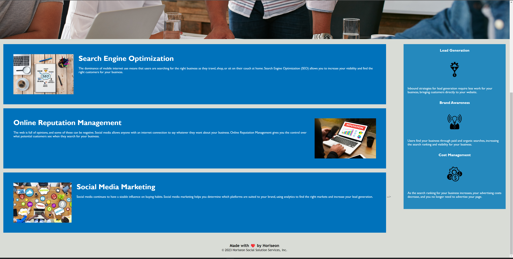

# Code Refactor Starter Code
For this project, I've received an on-the-job ticket, providing me with starter code. As part of the assignment, I'm to refactor the HTML and CSS files to become for accessible, while NOT modifying any visual aspects of the webpage. A marketing agency has hired me to refactor an existing site to make it more accessible.

## Motivation
For front-end and junior developers, it's common to take existing code and refactor it to meet a certain set of standards or implement a new technology. In this Challenge, I gain a value experience in doing exactly that, so that I better understand the differences between semantic elements and non-semantic elements. It's  important that if you touch code, you always leave it a little bit cleaner than how you received it.

## Screenshots
Image (1 of 2)

Image (2 of 2)

## Tech/framework used
HTML & CSS.

## Contribute

To contribute, suggestions / changes may be made to improve the overall accessibility of this website, while not changing any visual aspects.

## License
None
